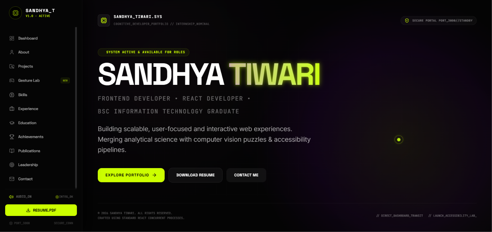
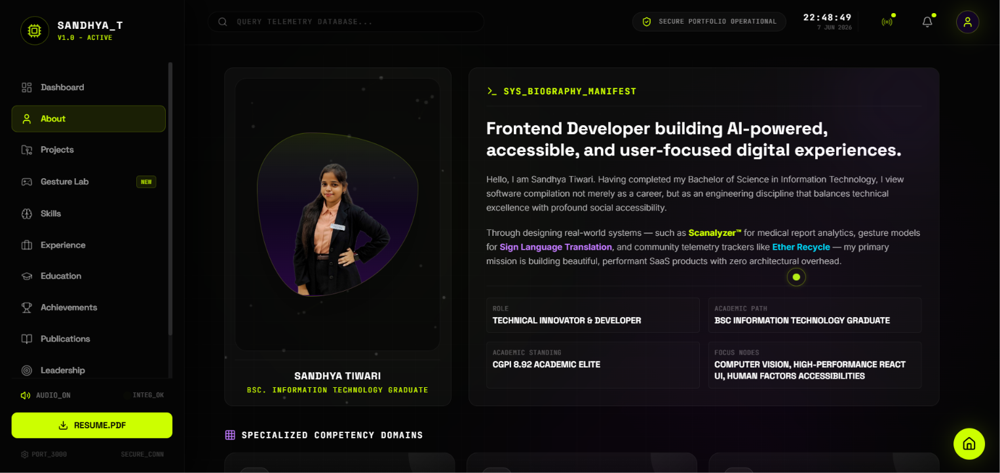

# 👩‍💻 Sandhya Tiwari Portfolio

A modern cyberpunk-inspired developer portfolio showcasing my projects, technical skills, certifications, achievements, publications, leadership experience, and contact information.

## 📸 Preview

🌐 Live Website: https://sandhya-tiwari-portfolio.vercel.app

---

## 🚀 Features

- Interactive Cyberpunk UI
- Responsive Design
- Project Showcase
- Skills Dashboard
- Experience Timeline
- Education Section
- Certifications & Achievements
- Research Publications
- Leadership Activities
- Resume Download
- Contact Form with EmailJS Integration
- Firebase Firestore Contact Logging
- Google Analytics Tracking

---

## 🛠️ Tech Stack

### Frontend

- React.js
- TypeScript
- Vite
- Tailwind CSS

### Backend Services

- Firebase Firestore
- EmailJS

### Analytics

- Google Analytics 4

### Deployment

- Vercel

---

## 📂 Sections

### Dashboard

Introduction and quick overview.

### About

Personal profile and career summary.

### Projects

Featured development projects including:

- FinTrack Expense Tracker
- Trippy Go
- Scafe
- AI-Based Health Report Analyzer
- Investment Portfolio Management System

### Skills

Technical skills and technologies.

### Experience

Internships and professional experience.

### Education

Academic qualifications and achievements.

### Achievements

Certifications, hackathons, competitions, research presentations, and awards.

### Publications

Research papers and academic publications.

### Leadership

Event coordination, volunteering, and leadership roles.

### Contact

Direct contact form powered by EmailJS.

---

## 📸 Preview

---

## 📊 Certifications & Achievements

- Aavishkar Research Convention Final Round
- Aavishkar Zonal Round Winner
- Coding Execution Championship
- Microsoft 365 Copilot
- Prompt Engineering
- CMCA Workshop
- IIBA Participation
- Guinness World Record Participation
- TCS iON Career Edge
- Project Management Institute (PMI)
- Artificial Intelligence Workshop
- MVLU Hackathon 2025
- And many more

---

## 📄 Resume

Resume can be downloaded directly from the portfolio.

---

## 📬 Connect With Me

- LinkedIn: https://www.linkedin.com/in/sandhya-tiwari1752005/
- GitHub: https://github.com/Sandhya175
- Email: sandhyatiwari1755@gmail.com

---

## ⭐ Support

If you like this portfolio, consider giving the repository a star.

---

Built with ❤️ by Sandhya Tiwari
